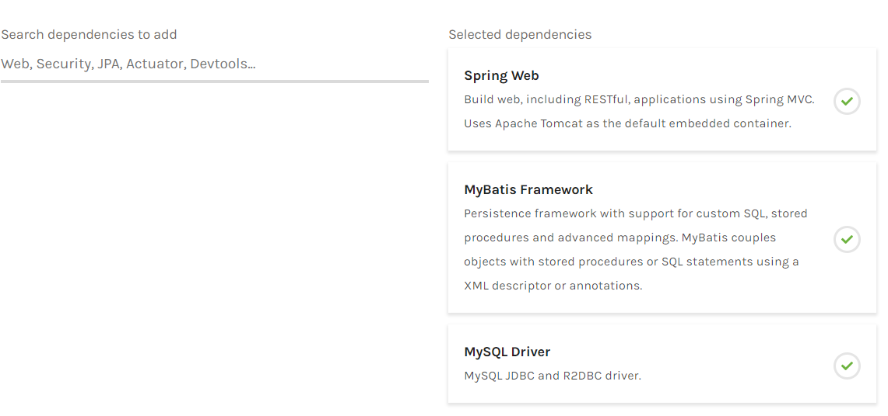
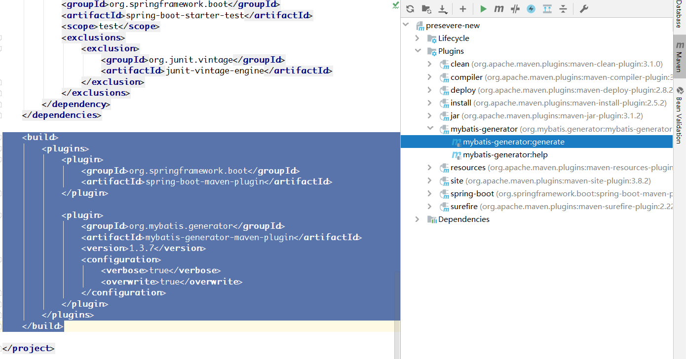
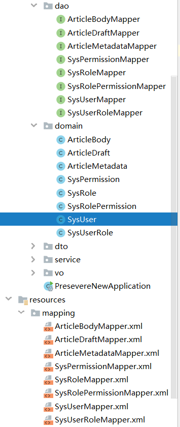

### SpringBoot搭建后台

#### 获取初始代码

使用Intellij idea或者[http://start.spring.io/](http://start.spring.io/)来生成初始结构，选择这三个依赖即可：

生成好了以后用idea打开它，等待maven的依赖下载完成后，便可以开始配置了。

#### 配置骨架

首先要添加一些依赖，便于后面的开发：

``` xml
<dependency><!-- JWT，用于生成前后端分离鉴权使用的token -->
  <groupId>com.nimbusds</groupId>
  <artifactId>nimbus-jose-jwt</artifactId>
  <version>8.2.1</version>
</dependency>
<dependency><!-- 常用工具类 -->
  <groupId>com.google.guava</groupId>
  <artifactId>guava</artifactId>
  <version>28.0-jre</version>
</dependency>
<dependency><!-- 数据库连接池，自带监控功能 -->
  <groupId>com.alibaba</groupId>
  <artifactId>druid-spring-boot-starter</artifactId>
  <version>1.1.20</version>
</dependency>
```

resources/application.properties文件改名为后缀.yml，然后配置：

``` yaml
server:
  port: 4399 #端口配置，空闲端口爱多少多少

spring:
  datasource:
    type: com.alibaba.druid.pool.DruidDataSource
    druid:
      # mysql8需要指定时区
      # 不使用ssl连接
      url: jdbc:mysql://阿里云公网IP:3306/db_presevere_new?serverTimezone=Asia/Shanghai&useSSL=false
      username: root
      password: root
      # mysql的jdbc驱动版本好像是6以上就要使用这个类作为驱动类了
      driver-class-name: com.mysql.cj.jdbc.Driver

mybatis:
  # mybatis配置domain别名需要用到的配置，虽然我没用到
  type-aliases-package: cn.gmwenterprise.presevere.domain
  # mapper.xml的位置，mybatis最好还是使用xml来编写sql，便于控制，便于分离，而且能够写递归（注解似乎无法写递归）
  mapper-locations: classpath:mapping/**

logging:
  level:
    # 显示每一次查询sql的mybatis日志
    cn.gmwenterprise.presevere.dao: DEBUG
```

然后创建包结构，大致如下所示：

``` yaml
cn:
  gmwenterprise:
    presevere:
      config:
        # 配置类
        interceptor:
          # 全局配置拦截器
      common:
        # 公共类
      domain:
        # 实体
      dao:
        # mapper接口
      service:
        # 服务
        impl:
          # 服务实现
      controller:
        # 控制器
      dto:
        # 控制器接受参数封装
      vo:
        # 控制器返回参数封装
```

配置到此处也就完成了这个架构的基本骨架。

#### 生成基本的DATA ACCESS OBJECT和DOMAIN

接下来使用mybatis-generator代码生成工具来生成数据库表对应的domain, dao, mapper。首先在src/main/resources目录下新建generatorConfig.xml文件：

``` xml
<?xml version="1.0" encoding="UTF-8"?>
<!DOCTYPE generatorConfiguration
    PUBLIC "-//mybatis.org//DTD MyBatis Generator Configuration 1.0//EN"
    "http://mybatis.org/dtd/mybatis-generator-config_1_0.dtd">

<generatorConfiguration>
    <classPathEntry location="D:\Maven\repository\mysql\mysql-connector-java\8.0.18\mysql-connector-java-8.0.18.jar"/>

    <!-- 这个配置是比较通用的一套配置 -->
    <context id="MySQLTables" targetRuntime="MyBatis3">
        <jdbcConnection
            driverClass="com.mysql.cj.jdbc.Driver"
            connectionURL="jdbc:mysql://阿里云公网IP:3306"
            userId="root"
            password="root">
        </jdbcConnection>

        <javaTypeResolver>
            <property name="forceBigDecimals" value="false"/>
            <!-- 使用java8新增的时间类，比Date好用到不知道哪里去了 -->
            <property name="useJSR310Types" value="true"/>
        </javaTypeResolver>

        <javaModelGenerator
            targetPackage="cn.gmwenterprise.presevere.domain" targetProject="src\main\java">
            <property name="enableSubPackages" value="true"/>
        </javaModelGenerator>

        <sqlMapGenerator
            targetPackage="mapping" targetProject="src\main\resources">
            <property name="enableSubPackages" value="true"/>
        </sqlMapGenerator>

        <javaClientGenerator
            type="XMLMAPPER" targetPackage="cn.gmwenterprise.presevere.dao"
            targetProject="src\main\java">
            <property name="enableSubPackages" value="true"/>
        </javaClientGenerator>

        <!-- 每一个table都对应了数据库一张表，只需要写好数据库名schema然后修改tableName就好了 -->
        <table tableName="数据库表明"
               schema="数据库" enableCountByExample="false" enableUpdateByExample="false"
               enableSelectByExample="false" enableDeleteByExample="false" selectByExampleQueryId="false">
            <generatedKey column="id" sqlStatement="MySql" identity="true"/>
        </table>
        <!-- ......此处省略八张表对应八个table的代码 -->
    </context>
</generatorConfiguration>
```

对于mybatis generator配置有疑问可以百度一下官网，文档是英文的，也可以看其他小伙伴写的博客，这里不多加赘述，只为了生成代码，减少工作而已。

然后在pom.xml中添加插件：

``` xml
<build>
    <plugins>
        <plugin>
            <groupId>org.springframework.boot</groupId>
            <artifactId>spring-boot-maven-plugin</artifactId>
        </plugin>

        <!-- 这个插件plugin就是mybatis generator了 -->
        <plugin>
            <groupId>org.mybatis.generator</groupId>
            <artifactId>mybatis-generator-maven-plugin</artifactId>
            <!-- 当前最新版本 -->
            <version>1.3.7</version>
            <configuration>
                <!-- 配置可以在官网文档中查到 -->
                <!-- verbose[生成时打印生成日志]，overwrite[每次重新生成都合并覆盖原文件] -->
                <verbose>true</verbose>
                <overwrite>true</overwrite>
            </configuration>
        </plugin>
    </plugins>
</build>
```

然后点击右侧的maven控制栏，如图所示：



之后就生成了对应的24个文件：



目前为止已经生成好了所有数据库表对应的实体类、持久层访问类。

#### 常用的一些全局工具类、常量

接下来写一个时间工具类，提供一些全局常量。

``` java
package cn.gmwenterprise.presevere.common;

import java.text.SimpleDateFormat;
import java.time.format.DateTimeFormatter;

public final class DateUtils {
    // 时间字符串的格式，在前后端分离数据传输中这种格式个人认为比较方便
    public static final String DATE_TIME_PATTERN = "yyyy-MM-dd HH:mm:ss";
    public static final String DATE_PATTERN = "yyyy-MM-dd";
    public static final String TIME_PATTERN = "HH:mm:ss";

    // 对应的Formatter，前面3个为java8的时间类格式化对象，最后一个为常用的Date格式化对象
    public static final DateTimeFormatter DATE_TIME_FORMATTER = DateTimeFormatter.ofPattern(DATE_TIME_PATTERN);
    public static final DateTimeFormatter DATE_FORMATTER = DateTimeFormatter.ofPattern(DATE_PATTERN);
    public static final DateTimeFormatter TIME_FORMATTER = DateTimeFormatter.ofPattern(TIME_PATTERN);
    public static final SimpleDateFormat SIMPLE_DATE_FORMAT = new SimpleDateFormat(DATE_TIME_PATTERN);
}
```

写一个方便通过静态方法获取Spring Bean的类：

``` java
package cn.gmwenterprise.presevere.common;

import org.springframework.beans.BeansException;
import org.springframework.context.ApplicationContext;
import org.springframework.context.ApplicationContextAware;
import org.springframework.stereotype.Component;

// 这个类声明为了一个bean且实现了ApplicationContextAware接口
// spring检测到后便会执行实现的方法，给全局静态变量赋值，这样就拿到了spring最为核心的ApplicationContext对象
@Component
public final class BeanHelper implements ApplicationContextAware {
    private static ApplicationContext context;

    @Override
    public void setApplicationContext(ApplicationContext applicationContext) throws BeansException {
        context = applicationContext;
    }

    // 在开发中经常会使用到一些全局的工具类，有些工具类会注册为bean方便管理调用，有了这个静态方法便会方便很多
    public static <T> T getBean(Class<T> tClass) {
        return context.getBean(tClass);
    }
}
```

#### 权限系统

采用了RBAC模型，百度可查。sys开头的五张表既是RBAC的基本表结构，用户与角色多对多关联，角色与权限多对多关联。如此便实现了可控制的权限模型。

前后端分离的项目，前端向后端发送请求，对于部分接口需要进行权限认证，不满足权限认证的请求将拒绝访问。

后端提供一个公开的身份验证接口（比如登陆），前端需要输入获取验证所需的账户\key，然后拿到后端核对，如果核对正确，则返回一串密钥。
之后的每一次前端请求都将携带这个密钥，访问限制接口都会要求检验这个密钥，只有检验通过才能访问对应接口。这差不多就是JWT方案的一个简要概述，token就是所谓的密钥，token本身就携带了加密的数据，可以在后台指定的签名下解析数据。

新建Token管理类：

``` java
package cn.gmwenterprise.presevere.common;

import com.fasterxml.jackson.databind.ObjectMapper;
import com.nimbusds.jose.*;
import com.nimbusds.jose.crypto.MACSigner;
import com.nimbusds.jose.crypto.MACVerifier;

// JWT有许多实现，我采用的实现大致写法如下所示，主要用到两个公开的静态方法
public final class TokenHelper {

    private static ObjectMapper objectMapper = null;
    private static MACSigner signer = null;
    private static MACVerifier verifier = null;
    private static final String SECRET_KEY = "409939b5c5274e9195d0565d34f4f0f5";
    private static final JWSHeader COMMON_HEADER = new JWSHeader(JWSAlgorithm.HS256);

    static {
        try {
            signer = new MACSigner(SECRET_KEY);
            verifier = new MACVerifier(SECRET_KEY);
        } catch (JOSEException ignored) {
        }
    }

    private static ObjectMapper getObjectMapper() {
        if (objectMapper == null) {
            objectMapper = BeanHelper.getBean(ObjectMapper.class);
        }
        return objectMapper;
    }

    // 加密数据生成token，失败返回null
    public static String generateToken(Object payload) {
        try {
            JWSObject jwsObject = new JWSObject(
                COMMON_HEADER,
                new Payload(getObjectMapper().writeValueAsString(payload))
            );
            jwsObject.sign(signer);
            return jwsObject.serialize();
        } catch (Exception e) {
            // 由于java的check exception特性，必须写这个异常捕获
            // 实际上这个异常在业务逻辑中是不允许出现的，是完全可以且应该规避的
            return null;
        }
    }

    // 解析token返回对应数据，失败返回null
    public static <R> R parseToken(String token, Class<R> type) {
        try {
            JWSObject jwsObject = JWSObject.parse(token);
            if (jwsObject.verify(verifier)) {
                String json = jwsObject.getPayload().toString();
                return getObjectMapper().readValue(json, type);
            }
            return null;
        } catch (Exception e) {
            return null;
        }
    }
}
```

我主要用到的数据主体其实就是用户信息SysUser类，对于每次携带的token都会将其解析为SysUser然后保存在这个请求存在的线程中，方便后面的一些需要用到用户数据的操作，所以建立一个当前用户信息存储类，由于采用了ThreadLocal所以信息变量之间都是线程安全的：

``` java
package cn.gmwenterprise.presevere.common;

import cn.gmwenterprise.presevere.domain.SysUser;

public final class AuthorizationHolder {
    private static ThreadLocal<SysUser> currentUser = new ThreadLocal<>();

    public static SysUser getCurrentUser() {
        return currentUser.get();
    }

    public static void setCurrentUser(SysUser sysUser) {
        currentUser.set(sysUser);
    }

    public static void removeCurrentUser() {
        if (currentUser.get() != null) {
            currentUser.remove();
        }
    }
}
```

如何定义接口是否需要验证权限呢？很简单，一个注解搞定：

``` java
package cn.gmwenterprise.presevere.common;

import java.lang.annotation.*;

@Target({ElementType.METHOD})
@Retention(RetentionPolicy.RUNTIME)
@Documented
public @interface AuthRequire {

    // 只需要在需要的控制器接口上添加这个注解，比如：
    /*
    @GetMapping("/authInterface")
    @AuthRequire(["相应权限代码"])
    public Object authInterface() { return "权限校验成功"; }
    */
    // 类型为数组，可以设置多个权限，即访问这个接口需要当前用户同时具备多个角色权限
    String[] value() default {};
}
```

#### 权限核心拦截器

上述工具类完成后，便开始编写两个拦截器。第一个拦截器的功能是获取请求中携带的token并解析为用户数据保存在当前请求线程中，在当前请求结束后删除掉用户数据。

``` java
package cn.gmwenterprise.presevere.config.security;

import cn.gmwenterprise.presevere.common.AuthorizationHolder;
import cn.gmwenterprise.presevere.common.TokenHelper;
import cn.gmwenterprise.presevere.domain.SysUser;
import org.slf4j.Logger;
import org.slf4j.LoggerFactory;
import org.springframework.stereotype.Component;
import org.springframework.util.StringUtils;
import org.springframework.web.servlet.HandlerInterceptor;

import javax.servlet.http.HttpServletRequest;
import javax.servlet.http.HttpServletResponse;

@Component
public class AuthenticationInterceptor implements HandlerInterceptor {
    private static final Logger log = LoggerFactory.getLogger(AuthenticationInterceptor.class);

    @Override
    public boolean preHandle(HttpServletRequest request, HttpServletResponse response, Object handler) throws Exception {
        // 通常的做法就是将token设置在请求头Authorization字段中
        String token = request.getHeader("Authorization");
        if (!StringUtils.isEmpty(token)) {
            log.info("Authorization: [{}]", token);
            SysUser currentUser = TokenHelper.parseToken(token, SysUser.class);
            if (currentUser != null) {
                AuthorizationHolder.setCurrentUser(currentUser);
            }
        }
        return true;
    }

    @Override
    public void afterCompletion(HttpServletRequest request, HttpServletResponse response, Object handler, Exception ex) throws Exception {
        AuthorizationHolder.removeCurrentUser();
    }
}
```

第二个拦截器则是判断接口是否需要验证权限，若需要则进行认证，认证成功予以通过，失败则返回错误信息。
通过我自己编写拦截器后进行测试，发现在拦截器的preHandle函数中第四个参数`Object handler`的类型只有在访问对应控制器接口的时候类型才会为HandlerMethod，而我添加控制器权限接口也是添加在method上，所以通过这个方式来判断method是否被我自己定义的`AuthRequire`注解所修饰；如果被修饰，则进行进一步操作。

``` java
package cn.gmwenterprise.presevere.config.security;

import cn.gmwenterprise.presevere.common.AuthRequire;
import cn.gmwenterprise.presevere.common.AuthorizationHolder;
import cn.gmwenterprise.presevere.common.Constants;
import cn.gmwenterprise.presevere.domain.SysPermission;
import cn.gmwenterprise.presevere.domain.SysUser;
import cn.gmwenterprise.presevere.service.UserService;
import cn.gmwenterprise.presevere.vo.AjaxResult;
import com.fasterxml.jackson.databind.ObjectMapper;
import org.slf4j.Logger;
import org.slf4j.LoggerFactory;
import org.springframework.stereotype.Component;
import org.springframework.web.method.HandlerMethod;
import org.springframework.web.servlet.HandlerInterceptor;

import javax.annotation.Resource;
import javax.servlet.http.HttpServletRequest;
import javax.servlet.http.HttpServletResponse;
import java.io.IOException;
import java.io.PrintWriter;
import java.lang.reflect.Method;
import java.util.Arrays;
import java.util.List;
import java.util.stream.Collectors;

@Component
public class SecurityInterceptor implements HandlerInterceptor {
    private static final Logger log = LoggerFactory.getLogger(SecurityInterceptor.class);

    @Resource
    UserService userService;

    @Override
    public boolean preHandle(HttpServletRequest request, HttpServletResponse response, Object handler) throws Exception {
        String[] permissions = getPermissions(handler);
        if (permissions != null && permissions.length > 0) {
            log.info("进入安全拦截器, 请求URL = [{}]", request.getRequestURL());
            SysUser currentUser = AuthorizationHolder.getCurrentUser();
            if (currentUser != null) {
                List<SysPermission> permissionList = userService.getAllPermissions(currentUser.getId());
                if (permissionList != null && permissionList.size() >= permissions.length) {
                    boolean hasPermission = permissionList.stream()
                        .map(SysPermission::getPermission)
                        .collect(Collectors.toList())
                        .containsAll(Arrays.asList(permissions));
                    if (hasPermission) {
                        return true;
                    }
                }
                return noAccess(response, "当前用户无访问权限");
            }
            return noAccess(response, "禁止访问，需要登陆");
        }
        return true;
    }

    @Resource
    ObjectMapper objectMapper;

    private boolean noAccess(HttpServletResponse response, String errorMsg) throws IOException {
        response.setCharacterEncoding(Constants.UTF_8);
        response.setContentType(Constants.APPLICATION_JSON);
        PrintWriter writer = response.getWriter();
        writer.write(objectMapper.writeValueAsString(AjaxResult.fail(errorMsg)));
        writer.flush();
        writer.close();
        return false;
    }

    private String[] getPermissions(Object handler) {
        if (handler instanceof HandlerMethod) {
            Method targetMethod = ((HandlerMethod) handler).getMethod();
            if (targetMethod.isAnnotationPresent(AuthRequire.class)) {
                String[] value = targetMethod.getAnnotation(AuthRequire.class).value();
                return value.length > 0 ? value : null;
            }
        }
        return null;
    }
}

```

同时这里用到了AjaxResult类，自己封装的一个Restful参数返回的类，结构比较简单：

``` java
package cn.gmwenterprise.presevere.vo;

public class AjaxResult {
    private static final int CODE_SUCCESS = 200;
    private static final String MESSAGE_SUCCESS = "request success";
    private static final int CODE_ERROR = 500;
    private static final String MESSAGE_ERROR = "request error";

    public static AjaxResult ok(Object data) {
        return new AjaxResult(CODE_SUCCESS, MESSAGE_SUCCESS, data);
    }

    public static AjaxResult fail(Object data) {
        return new AjaxResult(CODE_ERROR, MESSAGE_ERROR, data);
    }

    private int code;
    private String message;
    private Object data;

    private AjaxResult(int code, String message, Object data) {
        this.code = code;
        this.message = message;
        this.data = data;
    }

    // ...getter, setter
}
```

#### 核心配置类

相应的工具类、拦截器都写好了，接下来整合配置。也是比较简单，先把mybatis给配置了。只用到了一个注解，设置了basePackages，这样即便不给mapper接口添加注解spring也会去将其扫描为bean。

``` java
package cn.gmwenterprise.presevere.config;

import org.mybatis.spring.annotation.MapperScan;
import org.springframework.context.annotation.Configuration;
import org.springframework.stereotype.Repository;

@Configuration
@MapperScan(basePackages = "cn.gmwenterprise.presevere.dao")
public class MybatisConfig {}
```

由于使用了java8时间类，所以mybatis需要添加一个关于JSR310的依赖：

``` xml
<dependency>
    <groupId>org.mybatis</groupId>
    <artifactId>mybatis-typehandlers-jsr310</artifactId>
    <version>1.0.2</version>
</dependency>
```

然后是springmvc的配置。实现WebMvcConfigurer接口，覆盖一些默认方法，添加EnableWebMvc注解，提供一些初始化bean即可。

``` java
package cn.gmwenterprise.presevere.config;

import cn.gmwenterprise.presevere.config.security.AuthenticationInterceptor;
import cn.gmwenterprise.presevere.config.security.SecurityInterceptor;
import com.fasterxml.jackson.databind.ObjectMapper;
import com.fasterxml.jackson.datatype.jsr310.JavaTimeModule;
import com.fasterxml.jackson.datatype.jsr310.deser.LocalDateDeserializer;
import com.fasterxml.jackson.datatype.jsr310.deser.LocalDateTimeDeserializer;
import com.fasterxml.jackson.datatype.jsr310.deser.LocalTimeDeserializer;
import com.fasterxml.jackson.datatype.jsr310.ser.LocalDateSerializer;
import com.fasterxml.jackson.datatype.jsr310.ser.LocalDateTimeSerializer;
import com.fasterxml.jackson.datatype.jsr310.ser.LocalTimeSerializer;
import org.springframework.context.annotation.Bean;
import org.springframework.context.annotation.Configuration;
import org.springframework.core.convert.converter.Converter;
import org.springframework.format.support.FormattingConversionService;
import org.springframework.http.converter.HttpMessageConverter;
import org.springframework.http.converter.json.MappingJackson2HttpMessageConverter;
import org.springframework.stereotype.Component;
import org.springframework.web.servlet.config.annotation.*;

import javax.annotation.Resource;
import java.text.ParseException;
import java.time.LocalDate;
import java.time.LocalDateTime;
import java.time.LocalTime;
import java.util.Date;
import java.util.List;

import static cn.gmwenterprise.presevere.common.DateUtils.*;

@Configuration
@EnableWebMvc
public class SpringMvcConfig implements WebMvcConfigurer {

    @Override
    public void addCorsMappings(CorsRegistry registry) {
        // 跨域配置,cors方式跨域
        registry.addMapping("/**");
    }

    @Override
    public void addResourceHandlers(ResourceHandlerRegistry registry) {
        // 静态资源放行
        registry.addResourceHandler("/static/**").addResourceLocations("classpath:/static/");
    }

    // 导入两个拦截器
    @Resource
    AuthenticationInterceptor authenticationInterceptor;
    @Resource
    SecurityInterceptor securityInterceptor;

    @Override
    public void addInterceptors(InterceptorRegistry registry) {
        // 添加拦截器并使用order指定执行顺序，数值越小越优先
        registry.addInterceptor(authenticationInterceptor).order(1);
        registry.addInterceptor(securityInterceptor).order(2);
    }

    @Override
    public void configureMessageConverters(List<HttpMessageConverter<?>> converters) {
        // 添加消息转换器，由于我使用了java8的时间类，所以这里要使用自定义的objectMapper
        converters.add(new MappingJackson2HttpMessageConverter(objectMapper()));
    }

    @Bean
    public ObjectMapper objectMapper() {
        // 自定义的objectMapper，添加了时间转换模块
        ObjectMapper objectMapper = new ObjectMapper();
        objectMapper.registerModule(javaTimeModule());
        return objectMapper;
    }

    @Bean
    public JavaTimeModule javaTimeModule() {
        // 自定义java8时间转换模块
        JavaTimeModule javaTimeModule = new JavaTimeModule();
        javaTimeModule.addSerializer(LocalDateTime.class, new LocalDateTimeSerializer(DATE_TIME_FORMATTER));
        javaTimeModule.addSerializer(LocalDate.class, new LocalDateSerializer(DATE_FORMATTER));
        javaTimeModule.addSerializer(LocalTime.class, new LocalTimeSerializer(TIME_FORMATTER));
        javaTimeModule.addDeserializer(LocalDateTime.class, new LocalDateTimeDeserializer(DATE_TIME_FORMATTER));
        javaTimeModule.addDeserializer(LocalDate.class, new LocalDateDeserializer(DATE_FORMATTER));
        javaTimeModule.addDeserializer(LocalTime.class, new LocalTimeDeserializer(TIME_FORMATTER));
        return javaTimeModule;
    }

    interface String2LocalDateTime extends Converter<String, LocalDateTime> {}

    interface String2LocalDate extends Converter<String, LocalDate> {}

    interface String2LocalTime extends Converter<String, LocalTime> {}

    interface String2Date extends Converter<String, Date> {}

    // 这里必须先显示定义好接口类型，不然下面的方法使用lambda方式会报错

    /**
     * 定义请求参数进入controller后的转换方式
     */
    @Component
    static class ConvertersInitializer {
        public ConvertersInitializer(FormattingConversionService formattingConversionService) {
            formattingConversionService.addConverter((String2LocalDateTime) source -> LocalDateTime.parse(source, DATE_TIME_FORMATTER));
            formattingConversionService.addConverter((String2LocalDate) source -> LocalDate.parse(source, DATE_TIME_FORMATTER));
            formattingConversionService.addConverter((String2LocalTime) source -> LocalTime.parse(source, DATE_TIME_FORMATTER));
            formattingConversionService.addConverter((String2Date) source -> {
                try {
                    return SIMPLE_DATE_FORMAT.parse(DATE_TIME_PATTERN);
                } catch (ParseException e) {
                    e.printStackTrace();
                    return null;
                }
            });
        }
    }
}
```

如此便完成了基本配置。

(... 未完待续)

#### 系统初始化数据

#### 额外配置
